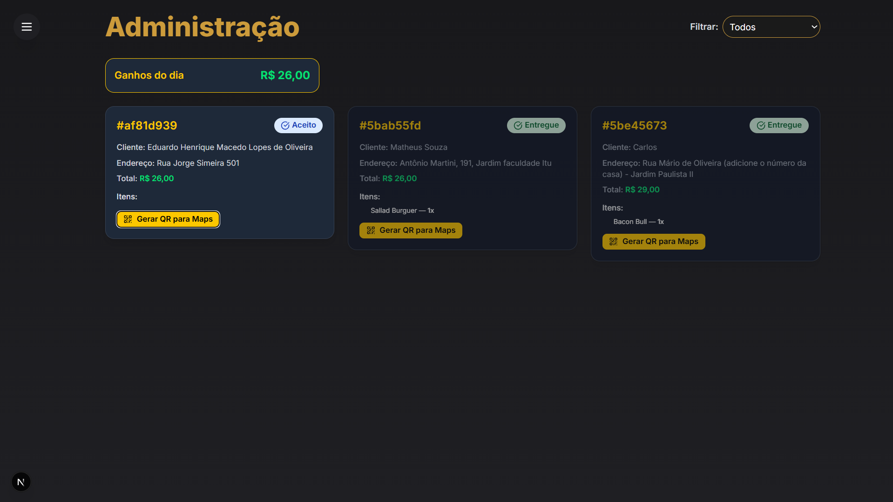

# Delivery Admin

Um painel administrativo moderno para gestão de clientes e pedidos de delivery, desenvolvido com Next.js, React, Supabase e uma interface elegante.

## ✨ Funcionalidades

- **Listagem de clientes** com dados de contato, endereço, total de pedidos e valor gasto.
- **Visualização detalhada** do cliente em modal, incluindo histórico de pedidos e link para localização no Google Maps.
- **Drawer lateral** para navegação rápida.
- **Integração com Supabase** para autenticação e persistência dos dados.
- **Interface responsiva** e animada com Framer Motion.
- **Notificações** com Sonner.

## 🚀 Tecnologias Utilizadas

- [Next.js](https://nextjs.org/)
- [React](https://react.dev/)
- [Supabase](https://supabase.com/)
- [Framer Motion](https://www.framer.com/motion/)
- [Lucide React Icons](https://lucide.dev/)
- [Tailwind CSS](https://tailwindcss.com/)
- [Sonner](https://sonner.emilkowal.ski/) (notificações)

## 📁 Estrutura de Pastas

```
components/         # Componentes reutilizáveis (cards, modais, drawer, etc)
hooks/              # Hooks customizados
lib/                # Funções utilitárias e integração com Supabase
types.ts            # Tipos globais (Customer, Order)
src/app/clientes/   # Página de clientes
src/app/suporte/    # Página de suporte
public/             # Assets estáticos
supabase/           # Migrations e estrutura do banco
```

## ⚡ Como rodar o projeto

1. **Clone o repositório:**
   ```sh
   git clone <url-do-repo>
   cd delivery-admin
   ```
2. **Instale as dependências:**
   ```sh
   npm install
   ```
3. **Configure o Supabase:**
   - Crie um projeto no [Supabase](https://supabase.com/)
   - Copie as variáveis de ambiente para `.env.local`:
     ```env
     NEXT_PUBLIC_SUPABASE_URL=...
     NEXT_PUBLIC_SUPABASE_ANON_KEY=...
     ```
   - Execute as migrations SQL em `supabase/migrations/`.
4. **Inicie o servidor de desenvolvimento:**
   ```sh
   npm run dev
   ```
5. **Acesse:**
   - [http://localhost:3000](http://localhost:3000)

## 🛠️ Scripts úteis

- `npm run dev` — inicia o servidor Next.js em modo desenvolvimento
- `npm run build` — build de produção
- `npm run start` — inicia o servidor em produção

## 🖼️ Preview



## 📌 Observações

- O sistema é totalmente responsivo e pode ser utilizado em dispositivos móveis.
- Para notificações sonoras, utilize o arquivo `public/notify.mp3`.
- O código é modularizado para facilitar manutenção e evolução.

## 📄 Licença

Este projeto está sob a licença MIT.

---

Feito com ❤️ para facilitar a gestão do seu delivery!
